# **Template para los Participantes del Workshop**

## **Pasos Previos**

1. **Tener un correo electrónico activo.**

   - Esto es necesario para crear una cuenta de GitHub y/o LinkedIn.

2. **Contar con una foto profesional guardada como `foto.png`.**
   [Guía para fotos profesionales.](https://orientacion-laboral.infojobs.net/10-consejos-foto-cv)

3. **Contar con tu currículum vitae en formato PDF guardado como `cv.pdf`.**
   - Procura que sea actualizado y profesional.  
     [Ejemplos.](https://www.canva.com/resumes/templates)

## **Cómo Utilizar este Template**

### **1. Crear un Fork del Repositorio**

1. Haz clic en el botón **"Fork"** en la parte superior derecha del repositorio.

   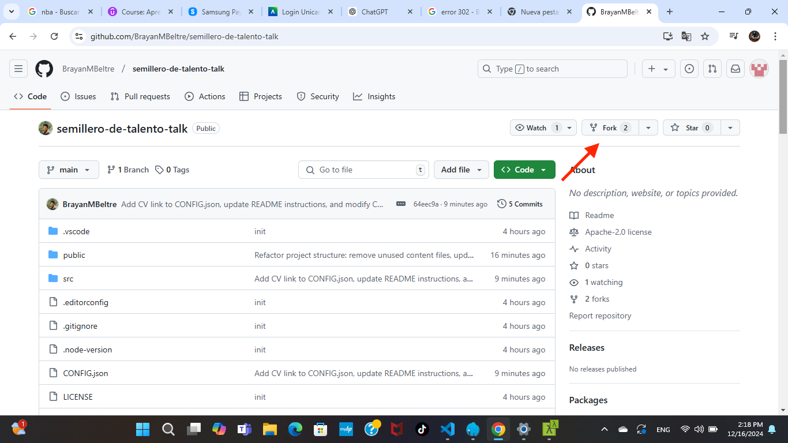

   > [¿Qué es un Fork?](https://docs.github.com/es/get-started/quickstart/fork-a-repo)

2. Luego, selecciona la opción **"Crear fork"**.

   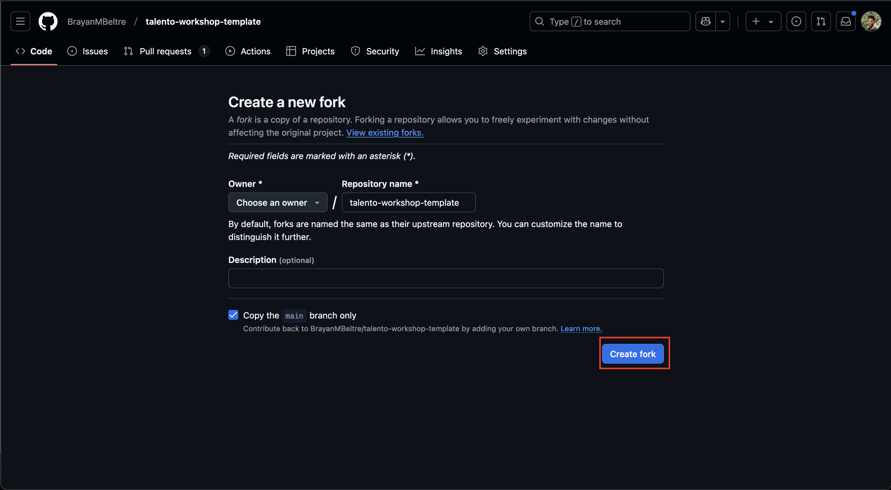

3. Esperar a que temrine el proceso.

   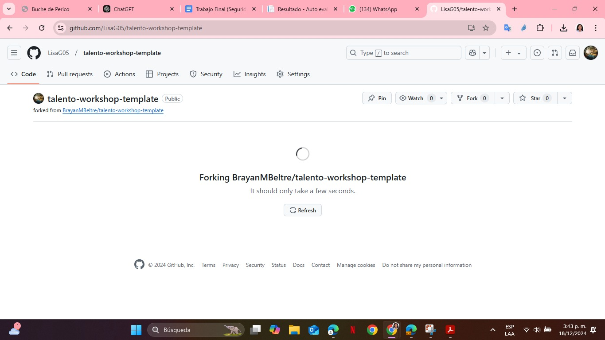

4. Una vez terminado el proceso continuar con el siguiente paso.

   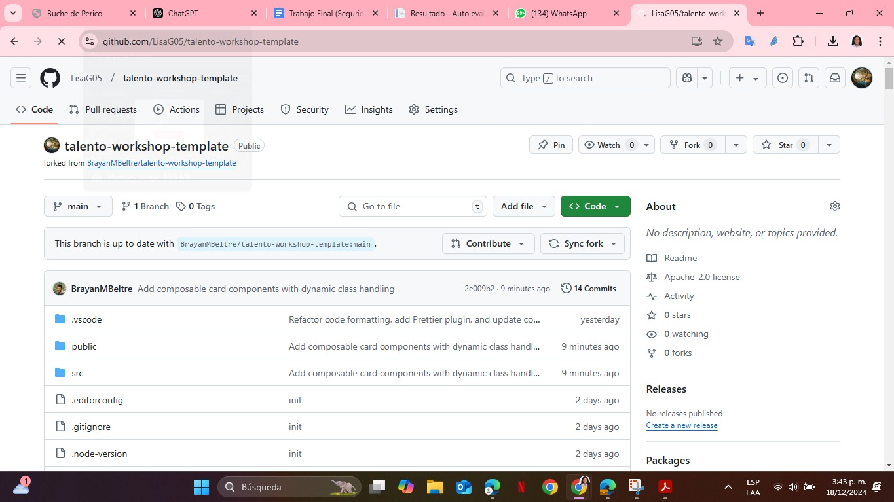

### **2. Abrir el Editor de Código en GitHub**

1. Para abrir el editor ve al En el repositorio recién creado y presiona la tecla **`"." (punto)`** en tu teclado.

   - En caso de que lo anterior no funciona cambia él **`.com`** en la URL por **`.dev`**.

   - Esto abrirá el editor de código en línea de GitHub.

   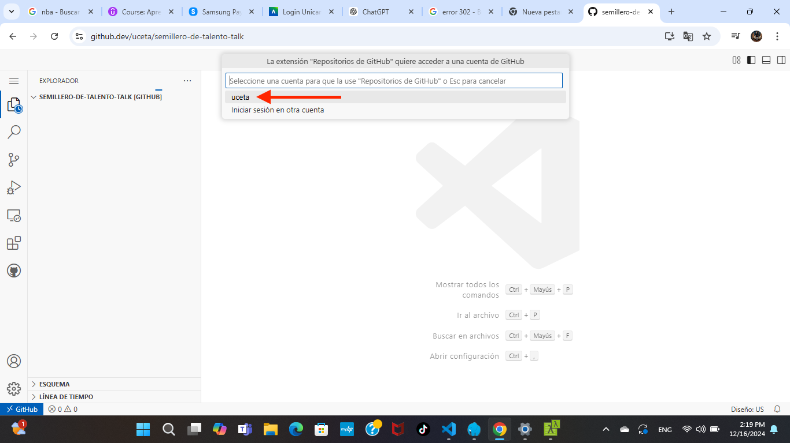

---

### **3. Subir Archivos Necesarios**

1. Localiza la carpeta **`public`** en el panel izquierdo del editor.

   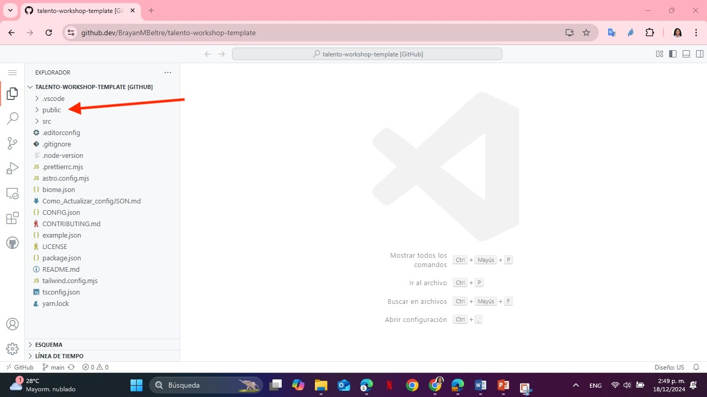

2. Arrastra y suelta los archivos **`cv.pdf`** y **`foto.png`** en esta carpeta.

   - **Revisa que los nombres sean exactamente como se indican para evitar errores.**

   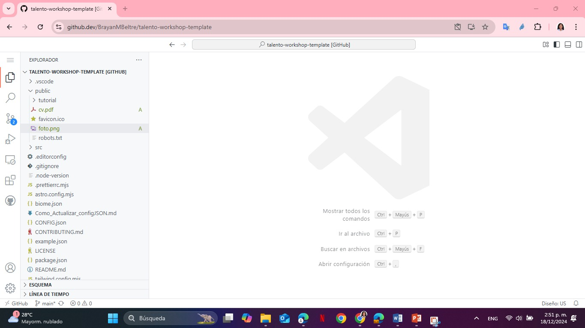

---

### **4. Personalizar la Configuración con ChatGPT**

1. Abre este [Prompt](https://chatgpt.com/share/6760b3ea-fc94-8003-b51b-6058631190d1) en una nueva pestaña.

2. Responde todas las preguntas y copia el resultado generado.

   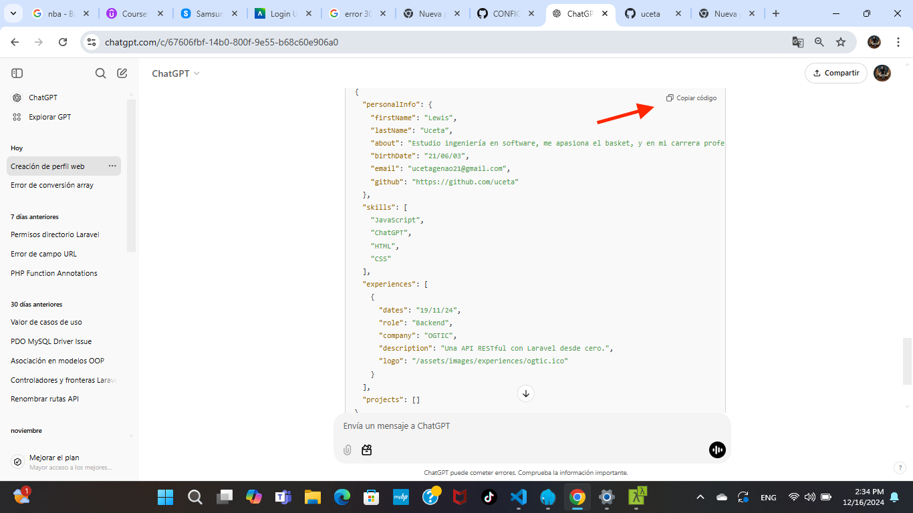

3. Regresa al editor y pega el resultado en el archivo `CONFIG.json`.

   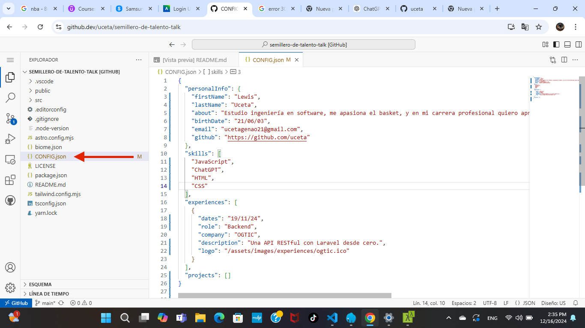

---

### **5. Subir Cambios al Repositorio**

1. En el panel izquierdo, haz clic en la sección **"Source Control"** (icono de rama).

   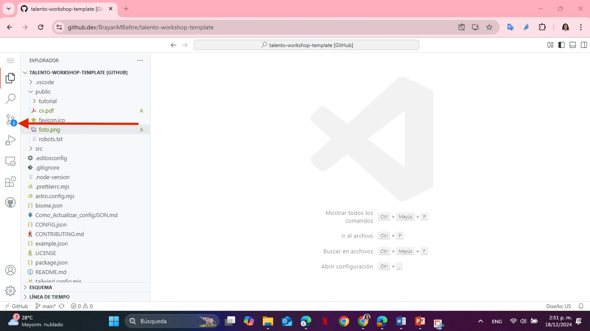

2. Escribe un mensaje claro sobre los cambios realizados, por ejemplo: _"Añadí mi configuración."_

   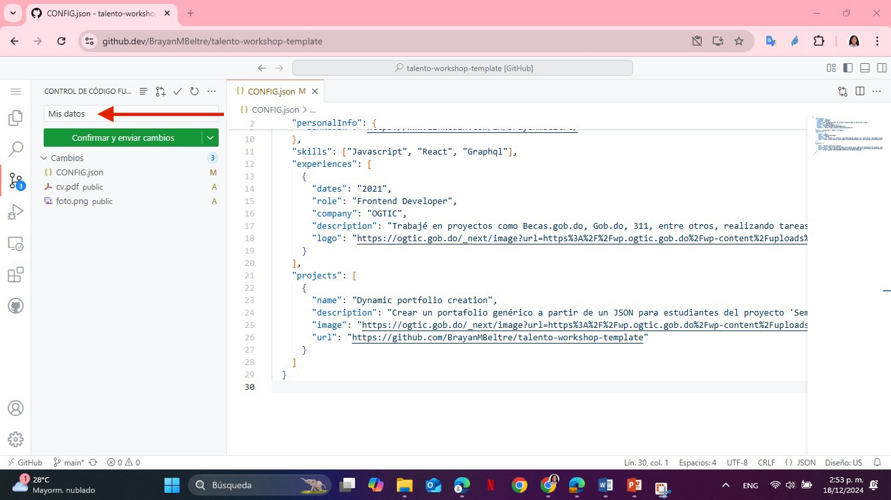

3. Quizas te aparezca un mensaje de confirmar cambios. Puedes cerrar este mensaje presionando el icono de X.

   

4. Presiona el botón **"Confirmar y enviar cambios"** para subir los cambios.  
   [¿Qué es un commit en Git?](https://git-scm.com/docs/git-commit)

   

---

## **Hacer Despliegue en Vercel**

1. Ve a [https://vercel.com](https://vercel.com) y haz clic en **"Start Deploying"**.

   - [Guía oficial de Vercel.](https://vercel.com/docs)

   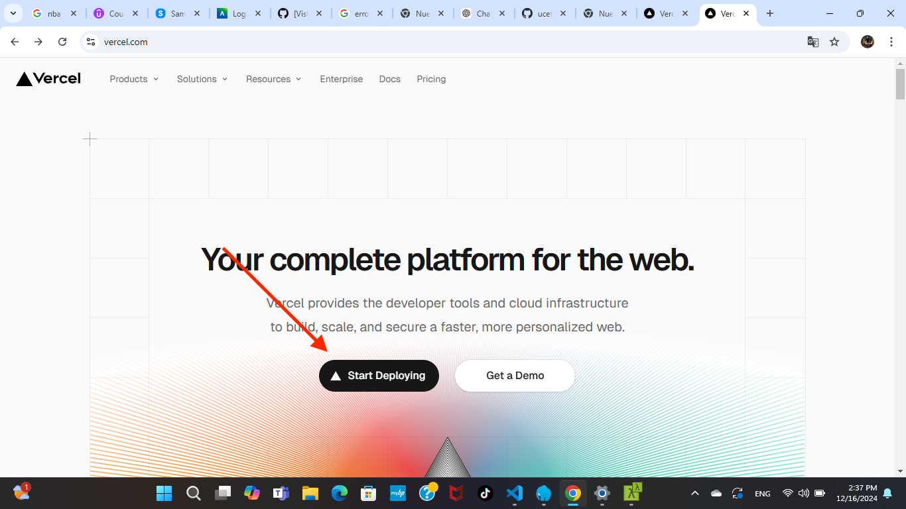

2. Inicia sesión con tu cuenta de GitHub y acepta las solicitudes de acceso.

   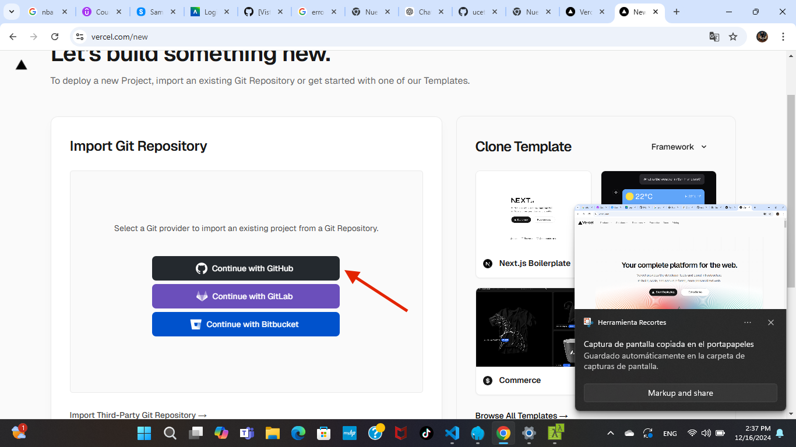

3. Instalar Gibhub

   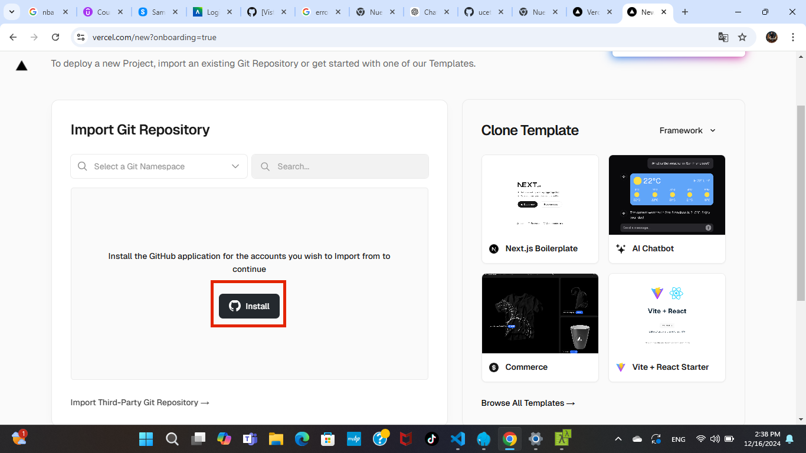

   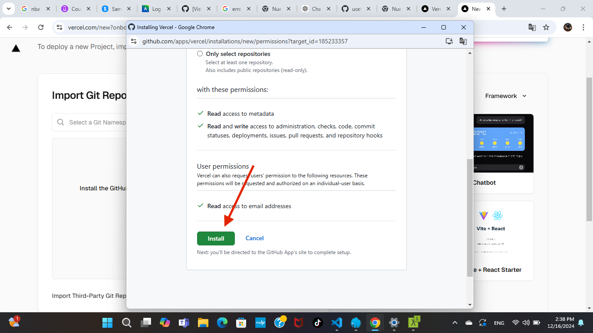

4. Selecciona tu repositorio y presiona el botón **"Import"**.

   

5. Haz clic en **"Deploy"** y espera a que termine el proceso.

   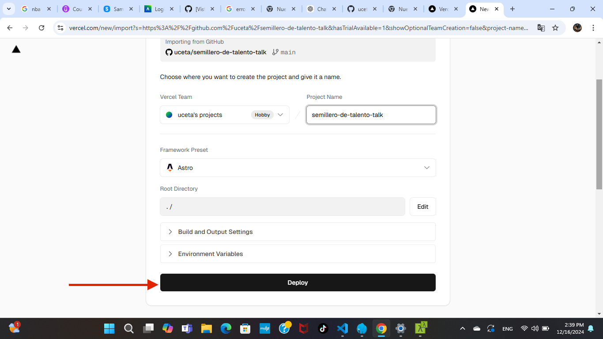

6. Una vez completado, copia la URL generada y verifica que tu página está activa.

   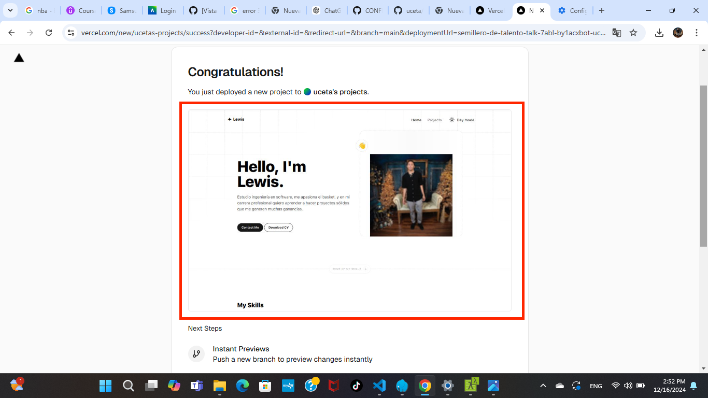

---

## **Enlaces Adicionales**

1. **Cómo configurar un dominio personalizado en Vercel:**
   - [Guía oficial.](https://vercel.com/docs/concepts/projects/domains)
2. **Más templates para proyectos:**
   - [DevDojo Templates.](https://static.devdojo.com/templates/)
3. **Crea un perfil personalizado de GitHub:**
   - [Personalización de perfil.](https://zzetao.github.io/awesome-github-profile/)

## **Propósito**

El objetivo de este workshop es que cada participante pueda crear y publicar un portafolio personal en la web utilizando herramientas modernas y un flujo de trabajo básico con GitHub y Vercel.

## **Agradecimientos**

- Template tomado de [https://github.com/ccbikai/astro-aria](https://github.com/ccbikai/astro-aria)
- Prompt de ChatGPT, ideas y consejos por [Samuel Piña](https://github.com/Samuelpinap)
